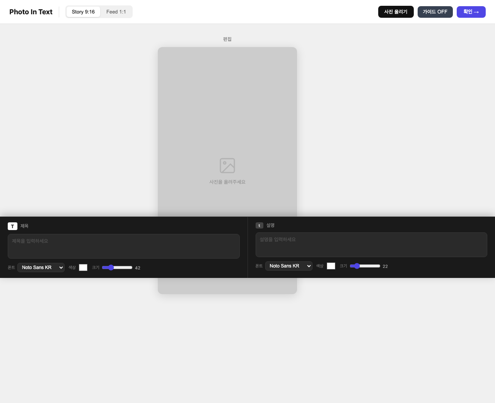

# Web Image Maker (Photo In Text)

사진 여러 장을 한 화면에서 합성하고, 제목/설명 텍스트를 얹어 SNS 업로드용 이미지를 빠르게 만드는 웹 에디터입니다.



## 1. 프로젝트 목적

iPhone 기본 편집 기능만으로는 아래 작업이 번거롭거나 제한적입니다.

- 여러 사진을 레이어처럼 겹쳐 배치하기
- 텍스트(제목/설명)의 폰트/색상/크기를 즉시 바꿔가며 디자인하기
- Story(9:16), Feed(1:1) 같은 SNS 비율로 빠르게 출력하기

이 프로젝트는 위 문제를 해결하기 위해 만든 **경량 브라우저 기반 이미지 카드 제작 도구**입니다.

## 2. 주요 용도

- 인스타그램 스토리/피드용 썸네일, 카드뉴스 시안 제작
- 행사/공연/공지 이미지에 텍스트 오버레이 작업
- 모바일에서 빠르게 시안 만들고 PNG로 저장

## 3. 핵심 기능

- 포맷 전환: `Story 9:16`, `Feed 1:1`
- 다중 이미지 레이어:
  - 이미지 여러 장 업로드
  - 레이어 스트립에서 선택
  - 선택 레이어를 최상단으로 올리기
  - 선택 이미지 삭제 (버튼/키보드)
- 텍스트 편집:
  - 제목/설명 입력
  - 폰트, 색상, 크기 조절
  - `<br>`, `<hr>` 기반 줄바꿈/구분선 표현
- 미리보기/저장:
  - 확인 버튼으로 결과 미리보기
  - PNG 파일로 저장
- 모바일 사용성:
  - 반응형 하단 편집 패널
  - 선택 이미지에 두 손가락 `핀치 줌 + 회전 + 이동`
- 제작 보조:
  - 중앙선/안전영역 가이드 ON/OFF
  - 저장 시 가이드는 결과 이미지에 포함되지 않음
- 작업 복구:
  - `localStorage` 자동 저장/복구

## 4. 코드 구조 설명

현재는 단일 HTML 파일 구조로 구성되어 있습니다.

- `Photo In Text.html`
  - `<style>`: 전체 UI 스타일(헤더/캔버스/레이어바/모바일 탭)
  - `<body>`: 편집 캔버스, 미리보기 패널, 하단 텍스트 편집 패널
  - `<script>`: 상태 관리, Fabric.js 캔버스 제어, 이벤트 처리, 저장/복구 로직

주요 로직 개요:

- `initCanvas()`
  - 포맷별 캔버스 크기 초기화
  - 선택/수정/추가/삭제 이벤트 바인딩
- `loadImage()`
  - 업로드 이미지를 캔버스 비율에 맞게 삽입
- `rebuildContent(type)`
  - 제목/설명을 Fabric Group으로 재구성
- `renderLayerPanel()` / `selectAndLift()`
  - 이미지 레이어 썸네일/순서 제어
- `renderPreview()` / `downloadImage()`
  - 최종 이미지 생성 및 다운로드
- `saveEditorState()` / `restoreEditorState()`
  - 자동 저장 및 재접속 복구
- `setupTouchGestures()`
  - 모바일 핀치/회전/이동 제스처 처리

## 5. 실행 방법

### 방법 A: 파일 직접 열기

1. `Photo In Text.html` 파일을 브라우저로 엽니다.
2. `사진 올리기`로 이미지 추가
3. 제목/설명 편집
4. `확인` → `저장하기`

### 방법 B: 로컬 서버로 실행 (권장)

일부 브라우저 보안 정책/리소스 로딩 이슈를 피하려면 로컬 서버 실행이 안정적입니다.

```bash
cd /Users/minju/Documents/PhotoInText
python3 -m http.server 4173
```

브라우저에서 아래 주소 접속:

- `http://127.0.0.1:4173/Photo%20In%20Text.html`

## 6. 사용 팁

- 입력창에서 텍스트 수정 중 `Backspace/Delete`는 이미지 삭제를 트리거하지 않습니다.
- 이미지를 먼저 탭해 선택한 뒤, 두 손가락 제스처를 사용하면 조작이 안정적입니다.
- 레이어 스트립 숫자 `1`이 최상위 레이어입니다.

## 7. 제작 정보

- 회사: **모모스테이지 엔터테이먼트**
- 개발자: **안장현**
- 제작 환경: **OpenAI Codex(코덱스) 기반 협업 개발 환경**

---

필요하면 다음 단계로 `README`를 배포/운영 관점(버전 관리 규칙, 배포 URL, 변경 이력)까지 확장할 수 있습니다.

## 8. GitHub Pages

- 배포 URL: `https://janghyeonan.github.io/web_img_maker/`
- 직접 파일 URL: `https://janghyeonan.github.io/web_img_maker/Photo%20In%20Text.html`

> 참고: GitHub Pages 설정이 비활성화되어 있으면 404가 보일 수 있습니다.

